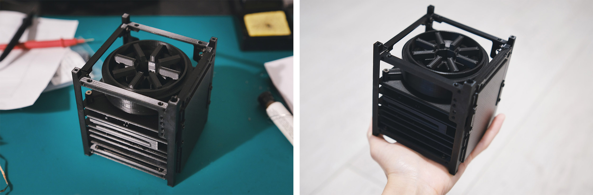

# KRAKsat mockup 3D print model

Have you always dreamt about having your own CubeSat satellite? Now you have a chance to 3D-print one!

### ◾ About the project

In this repository, you can find a 3D **mockup** model of the KRAKsat satellite that you can print at home. It is worth highlighting that **it is not a real satellite design** that was sent into the orbit - it's one of the simplified prototype models, adjusted to be easier to print (e.g. all PCB boards have components only on the one side)

You can find some more information about the KRAKsat satellite project [on my blog](https://alicja.space/projects/kraksat).

### ◾ What do you need?

To be able to print and assemble KRAKsat, you are going to need:
- **3D printer** (I used Ender 5 Pro)
- **filament** (PLA in my case)
- **slicer** (e.g. Cura with 0.4mm extruder, infill 10% and layer height 0.16/0.2mm, depending on the file)
- **nylon spacers M3 in different lengths (male and female)** to be put between PCBs (I bought a box of various ones and experimented - black look nice)
- **bolts and nuts in M2.5 and M3 sizes** for the frame assembly

### ◾ Files
In `components` folder, you can find .STL files that are ready to be uploaded to your slicer and printed. **Remember to place them with the flat surface facing down**.

You should print every file only once.

Feel free to experiment with colours and [let me know on Twitter](https://twitter.com/alicja_musial) if you print one - I'd love to see it! :)
